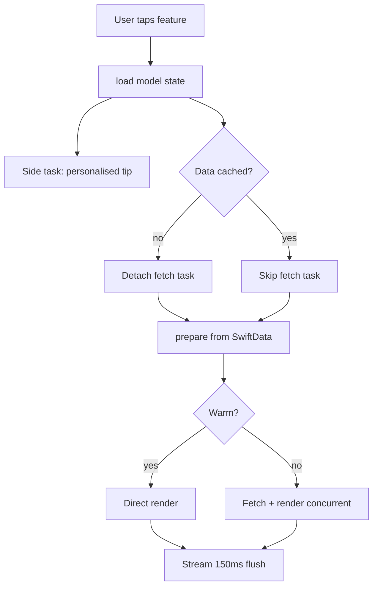
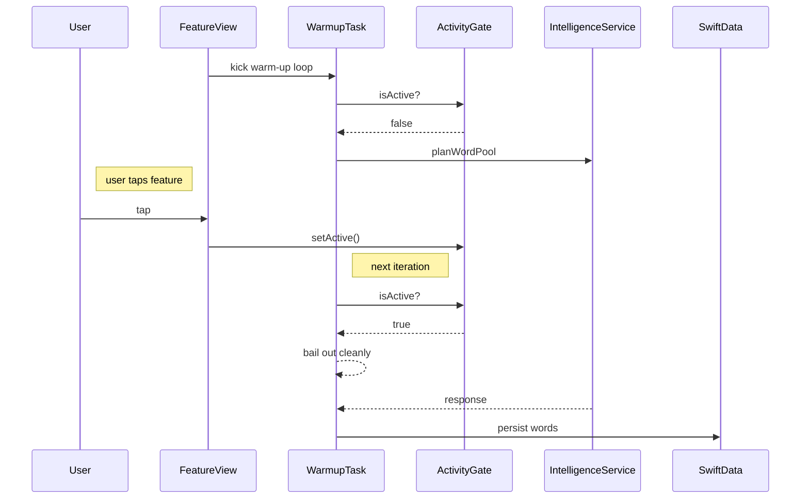
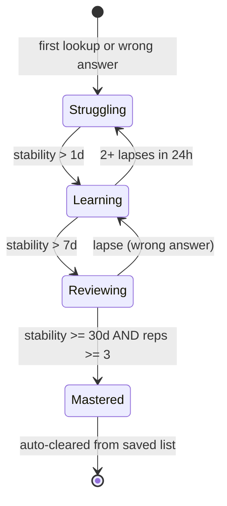
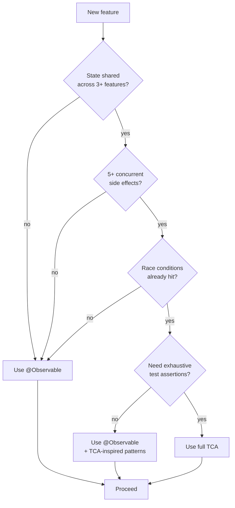

# Architecture Documentation Format

This skill encodes the documentation format that preserves architectural knowledge across time. The goal: 6 months from now, you (or another developer, or an AI tool) can reconstruct why decisions were made by reading the docs.

## When To Use

- After implementing a non-trivial feature
- When refactoring (capture the *new* shape AND why the old shape was rejected)
- When making a significant architecture decision
- When discovering an iOS limit that shaped the code

Do NOT use this skill for:
- Pure inline API docs (use minimal `///` comments instead)
- README marketing copy
- Tutorial-style "how to use this library" guides

## Format Contract

### File Location
- DocC catalog: `Documentation.docc/Resources/<flow>.md`
- No DocC catalog: `docs/architecture/<flow>.md`
- One file per major user-facing flow (lesson flow, scenarios flow, persistence layer, etc.)
- Plus one landing page (`architecture.md` or `overview.md`)

### File Structure

```markdown
# <Flow Name>

One-sentence summary of what this doc covers and what it does NOT cover.
Cross-link to related docs upfront ("See X for Y").

## §A First Topic

*<RationaleDimension>, <RationaleDimension>.*

Prose explaining the flow. Use file:line references as primary navigation:
`SomeFile.swift:42`

Not paraphrased descriptions. The code is the source of truth; this doc points at it.

### Subsection if needed

More detail. Tables for systematic data. Code snippets ONLY for non-obvious patterns.

## §B Next Topic

[...]

## Cross-doc links

- Where X is covered: `other-doc.md` §C.
- How Y feeds into Z: `another-doc.md` §A.
```

### The Five Rationale Dimensions

Every non-obvious section flags one or more:
1. **Performance** — latency, throughput, memory cost paid or saved
2. **Optimisation** — micro-level wins (cached formatter, deterministic shuffle, JSON-blob persistence to dodge schema migration)
3. **iOS limit** — platform ceilings the code routes around (context window, ANE single-tenancy, ActivityKit windows, container constraints)
4. **UX trade-off** — pedagogical or product trade-off the user feels (strict vs lenient matching, eager vs lazy loading)
5. **Science** — established research backing, named at one-line depth

Place rationale dimensions in italics directly under the section heading:

```markdown
## §C News pipeline

*iOS limit, Performance.*

Trigger: ...
```

### The Performance Ledger

For any feature with deliberate latency or size constants, include a Performance Ledger table:

```markdown
## Performance ledger

| Constant | Where | Reason | iOS limit |
|---|---|---|---|
| 150 ms | streaming flush window — `ListenFlowView.swift:614` | Coalesce per-token state writes | Main-thread render budget |
| 800 chars | germanText cap — `IntelligenceService.swift` | Prompt + examples overrun context above this | 3B model context window |
| 7 days | safety blacklist window | Re-test articles weekly in case model upgrade unblocks them | Apple Intelligence content classifier instability |
```

Every entry names: the constant, where to find it, why it's that value, and what iOS limit/budget it serves.

### Diagrams — Mandatory For Visual Readability

Docs without diagrams force readers to construct mental models from prose. For non-trivial flows, **diagrams are not optional** — they're the primary mechanism for making the doc readable in 60 seconds rather than 20 minutes.

Use Mermaid for all diagrams. Mermaid renders natively in DocC catalogs (Xcode 26), in GitHub, in most markdown viewers, and degrades gracefully to source-readable text. Do NOT use ASCII art — it's unreadable on mobile, doesn't render in DocC, and ages poorly.

#### Diagram Type Decision Tree

| What you're documenting | Diagram type | Example use case |
|---|---|---|
| Numbered steps in time, single actor | **Flowchart** (`flowchart TD`) | Feature load: tap → fetch → render → audio |
| Multiple components interacting, time order matters | **Sequence diagram** (`sequenceDiagram`) | View → Model → Service → SwiftData |
| Entity with distinct states + transitions | **State diagram** (`stateDiagram-v2`) | Connection: idle → connecting → connected → failed |
| "If X then Y else Z" branching | **Flowchart with decisions** (`flowchart TD` + diamond nodes) | Architecture decision: when TCA vs @Observable |
| Concurrent tasks + their gates | **Sequence diagram with `par`** | Two warm-up tasks racing through a flight-control actor |
| Data ownership / store relationships | **Flowchart with subgraphs** | SwiftData primary + GRDB side-store + UserDefaults |

#### Mandatory Diagrams Per Doc Type

- **Flow doc** (e.g. `lesson-flow.md`): at least one sequence diagram showing the main path through the flow, plus one flowchart for any complex decision branching.
- **Architecture overview** (`architecture.md`): a top-level flowchart showing app boot + major subsystems, plus a concurrency map diagram showing actors/gates and what they protect.
- **Persistence doc**: a data-flow diagram showing what reads from where and what writes to where.
- **State machine docs**: a state diagram with all transitions named.

A flow doc without diagrams should be considered incomplete during review.

#### Flowchart Example — Numbered Trace

````markdown
## Feature load — flow


````

#### Sequence Diagram Example — Multi-Component Interaction

````markdown
## Load race — warm-up vs user entry


````

#### State Diagram Example — Entity Lifecycle

````markdown
## VocabEntry — confidence ladder


````

#### Decision Flowchart Example — Architecture Choice

````markdown
## When to escalate to TCA


````

#### Diagram Discipline

- **Keep them current.** A wrong diagram is worse than no diagram. If you change the flow, update the diagram in the same commit.
- **One diagram per concept.** Multiple focused diagrams beat one overloaded one.
- **Label every arrow when meaning isn't obvious.** "yes/no", "on success/on error", "if cached/if cold", etc.
- **Include nodes for non-obvious actors.** The gate primitive, the actor that coordinates work — these should appear in diagrams.
- **Match diagram names to code names.** If your function is `warmTopicWords`, the diagram node says `warmTopicWords`.

#### Reading-Optimization Checklist

Each architecture doc must have, in this order from the top:
1. **One-sentence summary** of what the doc covers (and what it does NOT cover)
2. **Cross-link to related docs** upfront
3. **Architecture overview diagram** — readers scan this before any prose
4. **Prose sections** with rationale dimensions, file:line references, tables for systematic data
5. **Diagrams interleaved** at each section where flow/timing/state matters
6. **Performance ledger table** at the end if relevant
7. **Non-goals section**
8. **Cross-doc links**

### The Non-Goals Section

Document what's explicitly NOT done and why. This prevents future sessions from reintroducing removed patterns:

```markdown
## Out of scope / non-goals

These exist as scars, not TODOs. Don't reintroduce without explicit user request:

- **No prewarm() at launch.** Crashes ANE on iOS 26.x. Function body kept for the day the bug is fixed.
- **No TopicAssetWarmer.enqueue actor.** Was the source of the 68s cold-open regression; current single-flight + gate architecture replaces it.
- **No BGTaskScheduler background warm-up.** Separate scope; needs entitlement.
```

### File:Line References

Use them generously, ALWAYS in inline code formatting:

```markdown
The hot path lives in `AIExerciseGenerator.swift:38` — returns immediately when both `cachedTopicWords` and `cachedArc` are present.
```

Not:
> The hot path is in the AI exercise generator, which returns immediately when both topic words and arc are cached.

Reason: line numbers shift; readers verify against the actual code. The doc is a pointer, not a replacement.

### Cross-Doc Index

Every flow doc ends with cross-doc links:

```markdown
## Cross-doc links

- Where the warm-up populates `topicWords` / `storyArc`: `scenarios-flow.md` §G.
- How chips feed FSRS: `srs-and-vocabulary.md` §B.
- SwiftData fields the load path reads: `persistence.md` §A.
```

## Anti-Patterns

1. **Tutorial-style prose** ("First, you create a model. Then, you...") — These docs are for developers who already know the language. State what is, not how to do it.
2. **Paraphrasing the code** — If the doc says "fetches user from network", the next developer has to read both the doc and the code. Just say "see `UserService.swift:42`".
3. **Aspirational documentation** — Don't document what should be true. Document what IS true. If it changes, update the doc.
4. **Missing rationale** — A doc that says "we use SwiftData here" without saying *why* provides nothing.
5. **No non-goals section** — Future sessions will rebuild the thing you removed. Document removals explicitly.
6. **ASCII art diagrams** — Never. Use Mermaid always.

## Update Discipline

When code changes, the doc updates in the same commit. This is non-negotiable. The doc is part of the contract.

When a doc is created, add it to the cross-doc index in the landing page.

When a doc is deleted (feature removed), grep for inbound links and update them.

## Reference Loading Guide

| Reference | Load When |
|---|---|
| **[Examples](references/examples.md)** | Reading concrete examples of well-formed flow docs |
| **[Anti-Patterns](references/anti-patterns.md)** | Spotting common doc mistakes |
| **[Style Guide](references/style-guide.md)** | Sentence-level conventions (rationale italics, file:line format, etc.) |
| **[Diagram Cookbook](references/diagram-cookbook.md)** | Mermaid templates for flowcharts, sequence, state, decision diagrams |
