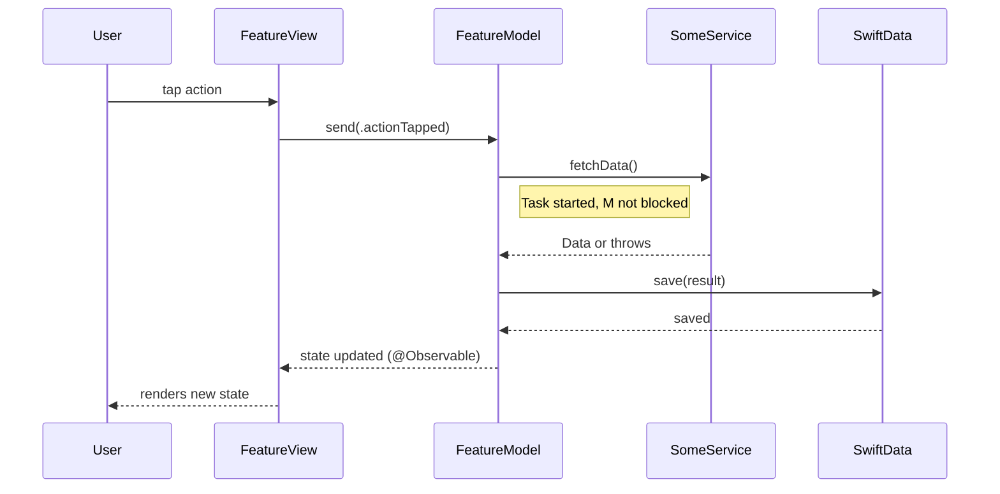
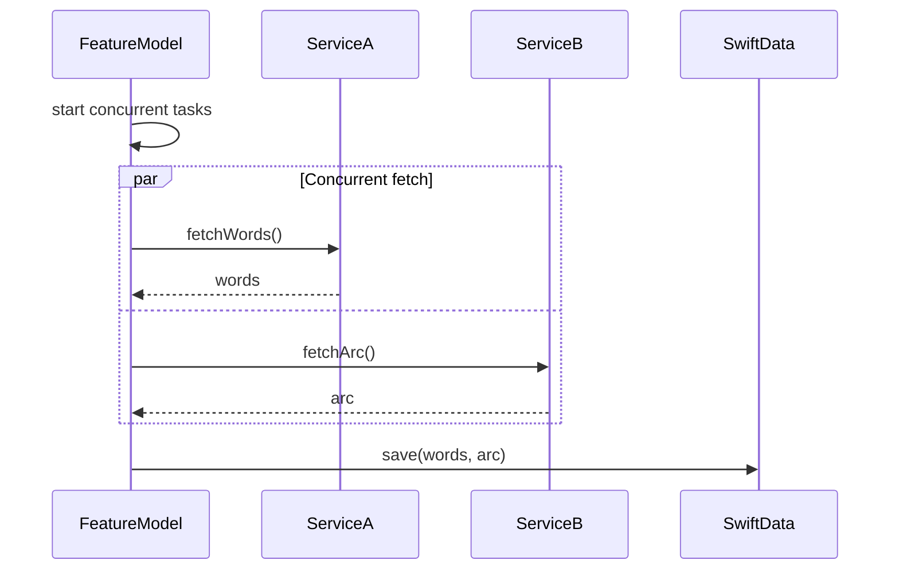
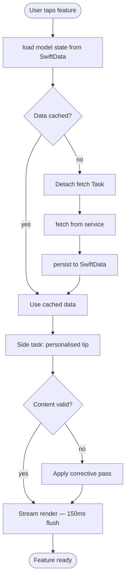
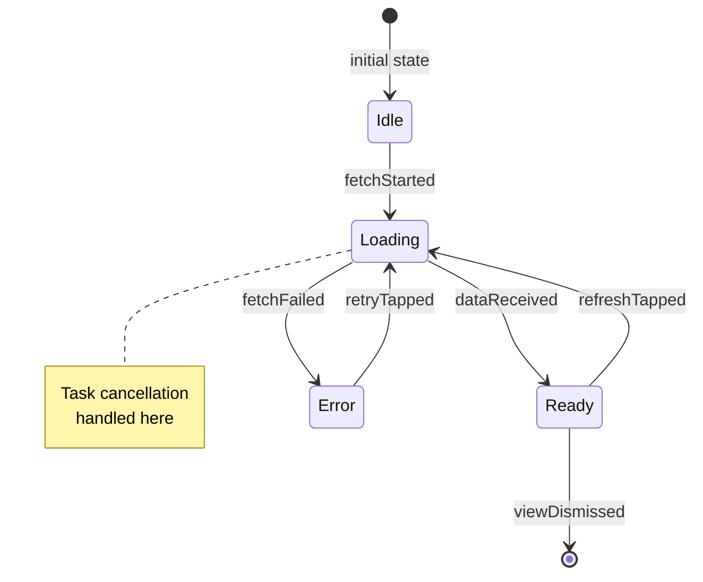
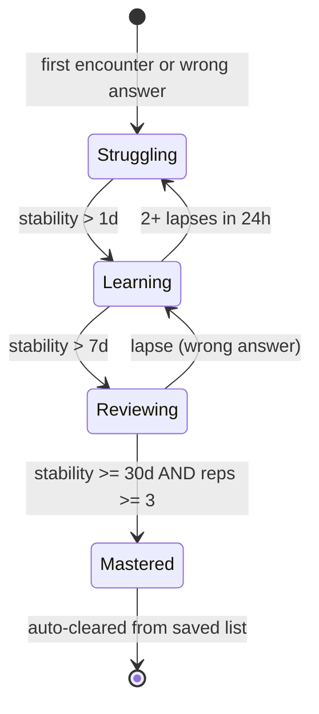
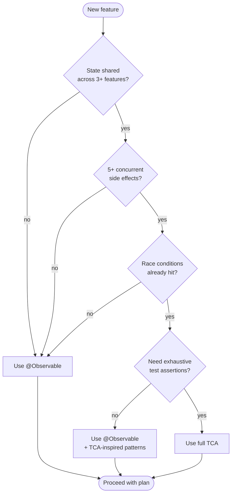
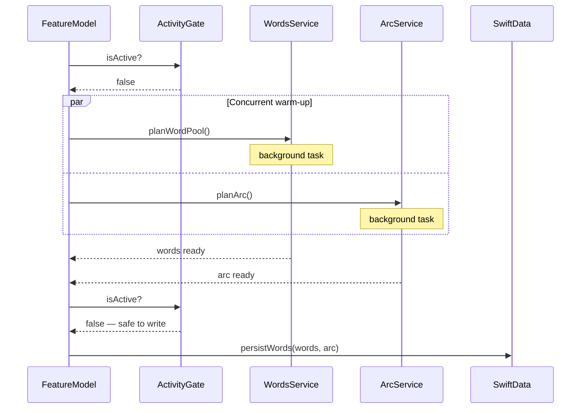

# Diagram Cookbook — Mermaid Templates

Copy-pasteable Mermaid templates for architecture documentation. Each section names the diagram type, when to reach for it, and provides a starting template.

---

## Workflow: `.mmd` → `.svg` → DocC

DocC does not render inline Mermaid. The correct pattern for any diagram that lives inside a `.docc` catalog:

### Step 1 — Write the Mermaid source

Create a `.mmd` file in `Documentation.docc/Resources/`. Name it `<feature>-<concept>.mmd`:

```
Documentation.docc/
└── Resources/
    ├── notes-load-flow.mmd       ← source (check in)
    ├── notes-load-flow.svg       ← generated (also check in)
    ├── sync-state-machine.mmd
    └── sync-state-machine.svg
```

The `.mmd` file contains only the Mermaid diagram — no fences, no markdown:

```
flowchart TD
    A([User taps Notes]) --> B[load NotesModel]
    B --> C{SwiftData cache?}
    C -->|hit| D[render immediately]
    C -->|miss| E[fetch + persist + render]
```

### Step 2 — Generate the SVG (in parallel with writing the doc)

```bash
# Install once
npm install -g @mermaid-js/mermaid-cli

# Generate — run this every time the .mmd changes
mmdc -i Documentation.docc/Resources/notes-load-flow.mmd \
     -o Documentation.docc/Resources/notes-load-flow.svg

# Or generate all at once
for f in Documentation.docc/Resources/*.mmd; do
  mmdc -i "$f" -o "${f%.mmd}.svg"
done
```

### Step 3 — Reference in the DocC article

Inside a `.md` article within the `.docc` bundle, use the image directive. DocC resolves the bare name to the matching `.svg` in `Resources/`:

```markdown
## Note load flow

The cold-start path fetches from the network then persists to SwiftData.
The warm path skips the fetch entirely.


```

### Rules

| Context | How to embed a diagram |
|---|---|
| `.docc` article (`.md` inside `.docc` bundle) | `` → resolves to `.svg` in Resources/ |
| Non-DocC markdown (`docs/architecture/*.md`, GitHub README) | Inline Mermaid fenced block (` ```mermaid ... ``` `) |
| Both contexts for same diagram | Write `.mmd` + generate `.svg`; use image ref in DocC, fenced block in plain `.md` |

**Always commit both** `.mmd` (source) and `.svg` (rendered). The `.svg` is checked in so DocC can serve it without a CI build step.

---

## 1. Sequence Diagram — Multi-Component Interaction

**When to use:** Multiple components (View, Model, Service, Database) interacting where time order matters. The canonical "what calls what, and in what order" diagram.

**When NOT to use:** Single actor doing sequential steps — use a flowchart instead.



**Parallel work (par block):**



---

## 2. Flowchart — Numbered Trace Through a Load Function

**When to use:** A single actor (view or model) executing a sequence of steps with branching decisions. Great for "what happens when the user taps X" flows.

**Shapes:** Rectangles for steps, diamonds for decisions, rounded rectangles for start/end.



---

## 3. State Diagram — Entity Lifecycle

**When to use:** An entity or connection that has distinct states with labeled transitions. Connection state machines, learning card confidence ladders, sync states.



**Entity confidence ladder example:**



---

## 4. Decision Flowchart — Architecture Choice

**When to use:** Branching decisions where the outcome depends on meeting criteria. TCA vs @Observable, SwiftData vs GRDB, when to add a dependency library.

**Convention:** Diamond nodes for questions, rectangle nodes for outcomes.



**Persistence decision:**

```mermaid
flowchart TD
    Start([Persistence needed]) --> Q1{User entity?<br/>notes, profile, progress}
    Q1 -->|yes| SD[SwiftData<br/>@Model + @Query]
    Q1 -->|no| Q2{Search index<br/>needed?}
    Q2 -->|yes| GRDB1[GRDB side store<br/>FTS5]
    Q2 -->|no| Q3{Analytics events<br/>buffer?}
    Q3 -->|yes| GRDB2[GRDB side store<br/>append-only]
    Q3 -->|no| UD[UserDefaults<br/>simple prefs]
```

---

## 5. Concurrent Operations — Par Blocks in Sequence Diagrams

**When to use:** Two or more async tasks launching simultaneously and converging at a gate/barrier.



---

## 6. Subsystem Overview — Flowchart With Subgraphs

**When to use:** Multiple stores, services, or subsystems that group related components. Data ownership overview, module dependency map.

```mermaid
flowchart TD
    subgraph App Entry
        AE[AppEntry.swift]
    end

    subgraph Primary Store
        SD[SwiftData ModelContainer]
        Q[@Query — reactive fetch]
        SD --> Q
    end

    subgraph Search Side Store
        GRDB[GRDB DatabasePool]
        FTS[FTS5 virtual table]
        GRDB --> FTS
    end

    subgraph UserDefaults
        UD[UserDefaults / AppStorage]
    end

    AE --> SD
    AE --> GRDB
    AE --> UD

    subgraph Features
        FM[FeatureModel]
        FV[FeatureView]
        FM --> FV
    end

    FM --> SD
    FM --> GRDB
    FM --> UD
    Q --> FV
```

---

## Tips

- Keep node labels short — 3–5 words max. Prose belongs in the surrounding doc.
- Use `Note` annotations in sequence diagrams sparingly — for genuinely surprising behavior only.
- Mermaid node IDs (`A`, `B`, `Q1`) are invisible to readers; use meaningful labels in the brackets.
- Test your Mermaid in a preview (GitHub, VS Code Mermaid extension) before committing.
