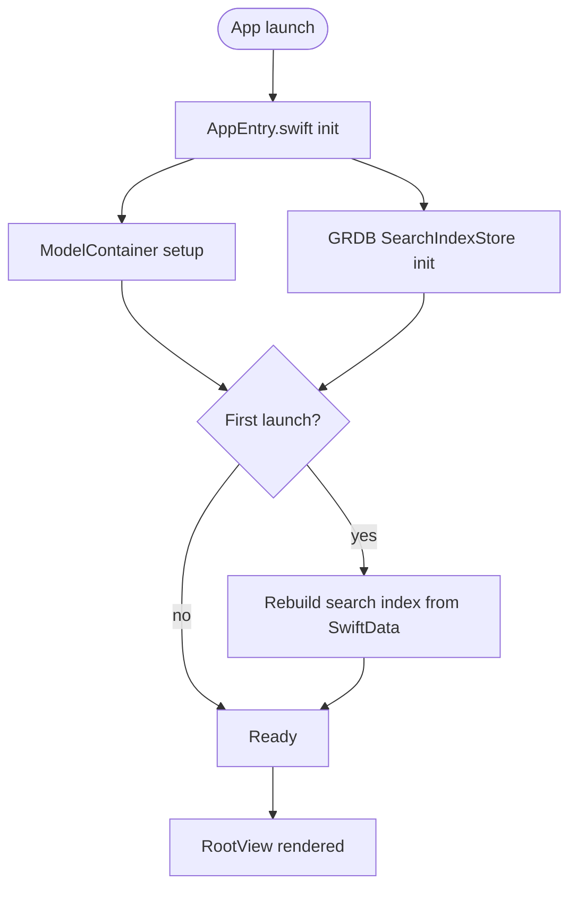
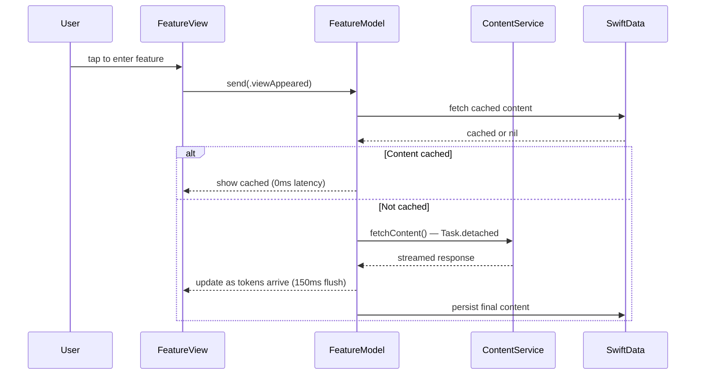
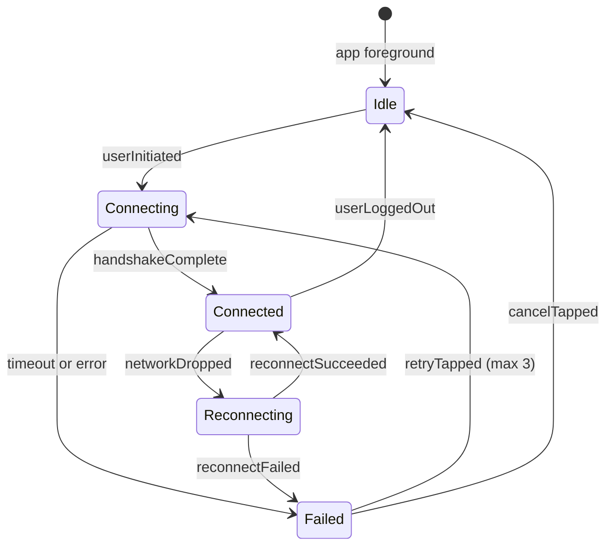

# Architecture Documentation Examples

Canonical examples of the "trace + why" documentation format. Each example references a specific technique from the format contract.

---

## Example 1: Architecture Overview Landing Page

**Demonstrates:** App-boot flowchart, concurrency map, performance ledger, non-goals.

````markdown
# Architecture Overview

This document is the landing page for all architecture docs. It covers app boot, concurrency primitives, and the performance budget. It does NOT cover feature-specific flows (see linked docs below).

## App Boot



## §A Concurrency map

*iOS limit, Performance.*

Three concurrency domains:

| Domain | Mechanism | What it protects |
|---|---|---|
| Main actor | `@MainActor` | All `@Observable` model mutations, SwiftUI state |
| Search index | `DatabasePool` (GRDB) | Concurrent reads, serialized writes |
| Analytics | `DatabaseQueue` (GRDB) | Serialized event appends |

The main actor is the only domain that touches `@Observable` properties. Background tasks (fetch, warm-up) complete on background queues and publish results via `await MainActor.run { }`.

Hot path: `AppEntry.swift:42` — `ModelContainer` is initialized synchronously at app boot.

## §B Performance ledger

| Constant | Where | Reason | iOS limit |
|---|---|---|---|
| 150 ms | stream flush — `FeatureView.swift:214` | Coalesce per-token state writes | Main-thread render budget |
| 10K rows | GRDB threshold — `data-layer-decisions` skill §B | @Query slows above this | SwiftData predicate scan |
| 300 KB | Search index cap per entry | FTS5 tokenizer stalls on very large documents | SQLite memory budget |

## Out of scope / non-goals

- **No CloudKit sync in v1.** SwiftData container is local-only. CloudKit integration is a separate milestone.
- **No background app refresh.** Warm-up happens at foreground entry only.

## Cross-doc links

- Feature load flow: `feature-flow.md` §A.
- Search index structure: `persistence.md` §B.
````

---

## Example 2: Feature Flow Doc — Numbered Trace

**Demonstrates:** Sequence diagram for multi-component interaction, file:line references, rationale dimensions per section.

````markdown
# Feature Load Flow

Covers the load path when a user enters the feature. Does NOT cover background warm-up (see `warmup-flow.md`).

## §A FeatureView.load() step-by-step

*Performance, iOS limit.*



The hot path (`FeatureModel.swift:38`): if `cachedContent != nil`, returns immediately with no network call. The 150ms flush window (`FeatureView.swift:214`) coalesces per-token state updates to stay within the main-thread render budget.

## §B Cache decision

*Optimisation, UX trade-off.*

Cache key: `userID + contentType + date` — deliberately excludes minute/second so the same content is reused within a calendar day. See `FeatureModel.swift:52`.

Trade-off: a user who opens the feature at 11:59 PM gets the same content at 12:01 AM. This is intentional — interrupting a session with new content is more disruptive than seeing yesterday's content for a minute.

## Out of scope / non-goals

- **No preloading at app launch.** Crashes ANE on first cold boot. See `warmup-flow.md` §D for the gate that prevents this.

## Cross-doc links

- Where warm-up populates the cache: `warmup-flow.md` §G.
- SwiftData schema for content: `persistence.md` §A.
````

---

## Example 3: State Machine Doc

**Demonstrates:** State diagram, non-goals for removed transitions.

````markdown
# Connection State Machine

Covers the lifecycle of a network connection in the app. Does NOT cover retry policy (see `networking.md`).

## §A States and transitions

*iOS limit.*



Implementation: `ConnectionManager.swift:18`.

iOS limit: Network.framework path monitoring fires on the main queue. The `networkDropped` transition must dispatch to main actor explicitly (`ConnectionManager.swift:67`).

## Out of scope / non-goals

- **No automatic retry after max retries.** Removed after UX testing showed users didn't trust silent retries. Manual retry only.
- **No exponential backoff in v1.** Fixed 2s retry. Backoff is planned for v2 when we have telemetry on failure rates.

## Cross-doc links

- How retry UI is presented: `error-handling.md` §B.
````

---

## Example 4: Persistence Doc — Data Flow

**Demonstrates:** Subgraph flowchart for store relationships, sync pattern rationale.

````markdown
# Persistence Layer

Covers the two-store architecture (SwiftData primary + GRDB search side-store). Does NOT cover CloudKit (out of scope for v1).

## §A Store overview

*Optimisation, iOS limit.*

```mermaid
flowchart TD
    subgraph SwiftData Primary
        MC[ModelContainer]
        NoteModel[@Model Note]
        MC --> NoteModel
    end

    subgraph GRDB Search Index
        DBP[DatabasePool]
        FTS[notes_fts — FTS5 virtual table]
        DBP --> FTS
    end

    subgraph UserDefaults
        UD[User preferences, flags]
    end

    App --> MC
    App --> DBP
    App --> UD

    NoteModel -->|save hook| FTS
```

SwiftData owns Note entities. The FTS5 table is a derived index — populated from SwiftData on first launch (`AppSetupModel.swift:44`) and kept in sync via save hooks (`NotesSyncService.swift:18`).

SwiftData @Query is used for all entity fetches. GRDB is used only for search result IDs — the app then fetches matching Note entities from SwiftData by ID.

## §B When to add a GRDB store

*Performance.*

Threshold: >10K rows or any FTS5 need. See `data-layer-decisions` skill for the full decision tree.

## Out of scope / non-goals

- **No GRDB for entity storage.** SwiftData is the source of truth for Note entities. GRDB is an index, not a store.
- **No CloudKit sync.** Separate milestone; requires entitlement and public container.

## Cross-doc links

- Sync service implementation: `sync-patterns.md` §A.
- Search feature: `search-flow.md` §A.
````
